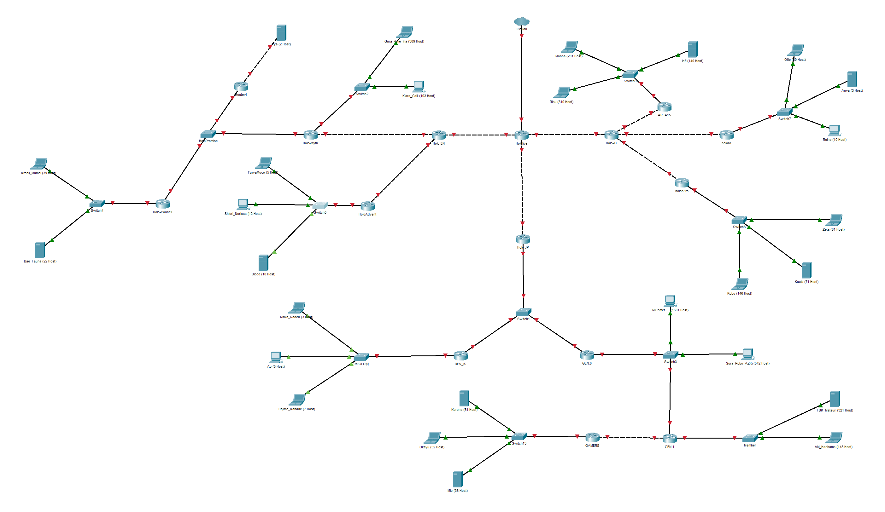
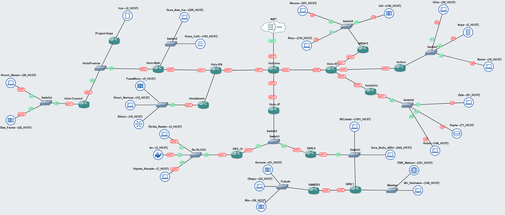
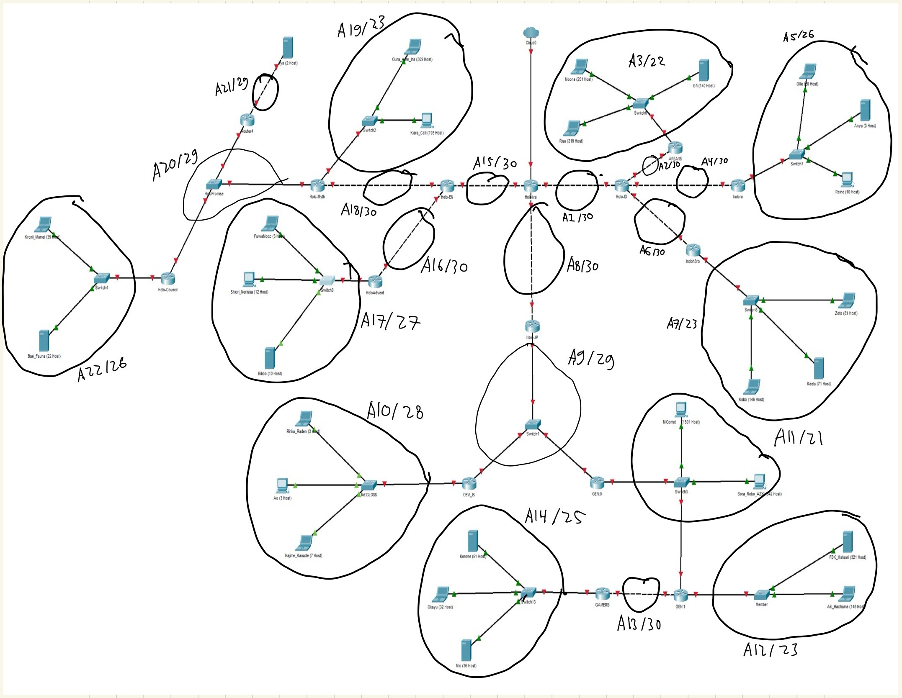

# Jarkom-Modul-4-IT13-2024

## Anggota Kelompok IT 13

| Nama Lengkap          | NRP        |
| --------------------- | ---------- |
| Muhammad Dzaky Ahnaf  | 5027231039 |
| Muhammad Nafi Firdaus | 5027231045 |

## Topologi CPT 



## Topologi GNS 



## Definisi
### CIDR
CIDR (Classless Inter-Domain Routing) adalah metode dalam jaringan komputer untuk mengalokasikan alamat IP dan mengatur rute IP dengan lebih efisien. Berbeda dengan sistem subnetting berbasis classful (di mana jaringan dibagi dalam kelas-kelas A, B, dan C dengan ukuran subnet yang sudah tetap), CIDR memperkenalkan fleksibilitas dengan menggunakan notasi prefix untuk menunjukkan panjang subnet mask. Hal ini memungkinkan pembagian alamat IP sesuai kebutuhan, tanpa harus bergantung pada batasan kelas.

### VLSM 
VLSM (Variable Length Subnet Mask) adalah metode subnetting dalam jaringan komputer yang memungkinkan penggunaan subnet mask dengan panjang yang berbeda-beda untuk setiap subnet dalam suatu jaringan IP. VLSM dikenal sebagai metode subnetting yang efisien karena memaksimalkan alokasi alamat IP berdasarkan kebutuhan jumlah host dalam tiap subnet.

## Pembagian Subnet 



## Tabel Routing 
| Nama Subnet          | Rute       | Jumlah IP       | Netmask      | 
| -- | ---------- | ---------- | ---------- |
| A1  | Hololive -> HoloID | 2 | /30 | 
| A2 | Hololive -> HoloID -> AREA-15 | 2 | /30 | 
| A3  |Hololive -> HoloID -> AREA-15 -> Switch6 -> Moona -> Switch6 -> Risu -> Switch -> Lofi | 661 | /22 | 
| A4 | Hololive -> HoloID -> holoro | 2 | /30 | 
| A5  | Hololive -> HoloID -> holoro -> Switch7 -> Ollie -> Switch7 -> Anya -> Switch7 -> Reine | 34 | /26 | 
| A6 | Hololive -> HoloID -> holoh3ro | 2 | /30 | 
| A7  | Hololive -> HoloID -> holoh3ro -> Switch8 -> Zeta -> Switch8 -> Kaela -> Switch8 -> Kobo | 29 | /33 | 
| A8 | Hololive -> HoloJP | 2 | /30 | 
| A9  |Hololive -> HoloJP -> Switch1 -> DEV_IS -> Switch1 -> GEN:0 | 3 | /29 | 
| A10 |Hololive -> HoloJP -> Switch1 -> DEV_IS -> Re:Gloss -> Ririka_Raden -> Re:Gloss -> Ao -> Re:Gloss-> Hajime_Kanade | 14 | /28 | 
| A11  | Hololive -> HoloJP -> Switch1 -> GEN:0 -> Switch3 -> MiComet -> Switch3 -> Sora_Robo_AZK -> Switch3 -> GEN:1 | 2045 | /21 | 
| A12 | Hololive -> HoloJP -> Switch1 -> GEN:0 -> Switch3 -> GEN:1 -> Member -> FBK_Matsuri -> Member -> Aki_Hachama | 470 | /23 | 
| A13  | Hololive -> HoloJP -> Switch1 -> GEN:0 -> Switch3 -> GEN:1 -> GAMERS | 2 | /30 | 
| A14 | Hololive > HoloJP > Switch1 > GEN:0 > Switch3 > GEN:1 > GAMERS > Fubuki > Korone -> Fubuki -> Okayu -> Fubuki -> Mio | 120 | /25 | 
| A15  | Hololive -> HoloEN | 2 | /30 | 
| A16 | Hololive -> HoloEN -> HoloAdvent | 2 | /30 | 
| A17  | Hololive > HoloEN > HoloAdvent > Switch0 > FuwaMoco -> Switch0 -> Shiori_Nerissa -> Switch0 -> Biboo | 28 | /27 | 
| A18 | Hololive -> HoloEN -> Holo-Myth | 2 | /30 | 
| A19  | Hololive -> HoloEN -> Holo-Myth -> Switch2 -> Gura_Ame_Ina -> Switch2 -> Kiara_Calli | 509 | /23 | 
| A20 | Hololive -> HoloEN -> Holo-Myth -> HoloPromise -> Project-Hope -> HoloPromise -> Holo_Council | 3 | /29 | 
| A21  | Hololive -> HoloEN -> Holo-Myth -> HoloPromise -> Project-Hope -> Irys | 3 | /29 | 
| A22 | Hololive -> HoloEN -> Holo-Myth -> HoloPromise -> Holo-Council -> Switch4 -> Kronii_Mumei -> Switch4 -> Bae_Fauna | 62 | /26 | 
| Total |  | 4263 | /19 | 

## Pembagian IP 
| Subnet | Network ID        | Netmask           | Broadcast      | Range IP                       |
|--------|-------------------|-------------------|----------------|--------------------------------|
| A1     | 10.70.19.48/30   | 255.255.255.252   | 10.70.19.51    | 10.70.19.49 - 10.70.19.50     |
| A2     | 10.70.19.52/30   | 255.255.255.252   | 10.70.19.55    | 10.70.19.53 - 10.70.19.54     |
| A3     | 10.70.8.0/22     | 255.255.252.0     | 10.70.11.255   | 10.70.8.1 - 10.70.11.254      |
| A4     | 10.70.19.56/30   | 255.255.255.252   | 10.70.19.59    | 10.70.19.57 - 10.70.19.58     |
| A5     | 10.70.18.192/26  | 255.255.255.192   | 10.70.18.255   | 10.70.18.193 - 10.70.18.254   |
| A6     | 10.70.19.60/30   | 255.255.255.252   | 10.70.19.63    | 10.70.19.61 - 10.70.19.62     |
| A7     | 10.70.16.0/23    | 255.255.254.0     | 10.70.17.255   | 10.70.16.1 - 10.70.17.254     |
| A8     | 10.70.19.64/30   | 255.255.255.252   | 10.70.19.67    | 10.70.19.65 - 10.70.19.66     |
| A9     | 10.70.19.96/29   | 255.255.255.248   | 10.70.19.103   | 10.70.19.97 - 10.70.19.102    |
| A10    | 10.70.19.32/28   | 255.255.255.240   | 10.70.19.47    | 10.70.19.33 - 10.70.19.46     |
| A11    | 10.70.0.0/21     | 255.255.248.0     | 10.70.7.255    | 10.70.0.1 - 10.70.7.254       |
| A12    | 10.70.14.0/23    | 255.255.254.0     | 10.70.15.255   | 10.70.14.1 - 10.70.15.254     |
| A13    | 10.70.19.72/30   | 255.255.255.252   | 10.70.19.75    | 10.70.19.73 - 10.70.19.74     |
| A14    | 10.70.18.0/25    | 255.255.255.128   | 10.70.18.127   | 10.70.18.1 - 10.70.18.126     |
| A15    | 10.70.19.76/30   | 255.255.255.252   | 10.70.19.79    | 10.70.19.77 - 10.70.19.78     |
| A16    | 10.70.19.80/30   | 255.255.255.252   | 10.70.19.83    | 10.70.19.81 - 10.70.19.82     |
| A17    | 10.70.19.0/27    | 255.255.255.224   | 10.70.19.31    | 10.70.19.1 - 10.70.19.30      |
| A18    | 10.70.19.84/30   | 255.255.255.252   | 10.70.19.87    | 10.70.19.85 - 10.70.19.86     |
| A19    | 10.70.12.0/23    | 255.255.254.0     | 10.70.13.255   | 10.70.12.1 - 10.70.13.254     |
| A20    | 10.70.19.104/29  | 255.255.255.248   | 10.70.19.111   | 10.70.19.105 - 10.70.19.110   |
| A21    | 10.70.19.112/29  | 255.255.255.248   | 10.70.19.119   | 10.70.19.113 - 10.70.19.118   |
| A22    | 10.70.18.128/26  | 255.255.255.192   | 10.70.18.191   | 10.70.18.129 - 10.70.18.190   |

## Konfigurasi Tiap Subnet 
### A1 
### Hololive (Router) 
```
enable
configure terminal
interface fa0/1
ip address 10.70.19.49 255.255.255.252
no shutdown
```
### Holo-ID (Router) 
```
enable
configure terminal
interface fa0/0
ip address 10.70.19.50 255.255.255.252
no shutdown
```
### A2 
### Holo-ID (Router) 
```
enable
configure terminal
interface fa0/1
ip address 10.70.19.53 255.255.255.252
no shutdown
```
### AREA15 (Router) 
```
enable
configure terminal
interface fa0/0
ip address 10.70.19.54 255.255.255.252
no shutdown
```
### A3
### AREA15 (Router) 
```
enable
configure terminal
interface fa0/1
ip address 10.70.8.1 255.255.252.0
no shutdown
```
### Moona 
```
Interface fa0
IP Address: 10.70.8.2
Subnet Mask: 255.255.252.0
Gateway: 10.70.8.1
```
### Risu 
```
Interface fa0
IP Address: 10.70.8.3
Subnet Mask: 255.255.252.0
Gateway: 10.70.8.1
```
### lofi
```
Interface fa0
IP Address: 10.70.8.4
Subnet Mask: 255.255.252.0
Gateway: 10.70.8.1
```
### A4 
### Holo-ID (Router) 
```
enable
configure terminal
interface fa1/0
ip address 10.70.19.57 255.255.255.252
no shutdown
```
### holoro (Router) 
```
enable
configure terminal
interface fa0/0
ip address 10.70.19.58 255.255.255.252
no shutdown
```
### A5 
### holoro (Router) 
```
enable
configure terminal
interface fa0/1
ip address 10.70.18.193 255.255.255.192
no shutdown
```
### Ollie 
```
Interface fa0
IP Address: 10.70.18.194
Subnet Mask: 255.255.255.192
Gateway: 10.70.18.193
```
### Anya 
```
Interface fa0
IP Address: 10.70.18.195
Subnet Mask: 255.255.255.192
Gateway: 10.70.18.193
```
### Reine 
```
Interface fa0
IP Address: 10.70.18.196
Subnet Mask: 255.255.255.192
Gateway: 10.70.18.193
```
### A6 
### Holo-ID (Router) 
```
enable
configure terminal
interface fa1/1
ip address 192.245.19.61 255.255.255.252
no shutdown
```
### holoh3ro (Router) 
```
enable
configure terminal
interface fa0/0
ip address 192.245.19.62 255.255.255.252
no shutdown
```
### A7 
### holoh3ro (Router) 
```
enable
configure terminal
interface fa0/1
ip address 10.70.16.1 255.255.254.0
no shutdown
```
### Zeta 
```
Interface fa0
IP Address: 10.70.16.2
Subnet Mask: 255.255.254.0
Gateway: 10.70.16.1
```
### Kaela 
```
Interface fa0
IP Address: 10.70.16.3
Subnet Mask: 255.255.254.0
Gateway: 10.70.16.1
```
### Kobo 
```
Interface fa0
IP Address: 10.70.16.4
Subnet Mask: 255.255.254.0
Gateway: 10.70.16.1
```
### A8 
### Hololive (Router) 
```
enable
configure terminal
interface fa1/0
ip address 10.70.19.65 255.255.255.252
no shutdown
```
### HoloJP (Router) 
```
enable
configure terminal
interface fa0/1
ip address 10.70.19.66 255.255.255.252
no shutdown
```
### A9 
### HoloJP (Router) 
```
enable
configure terminal
interface fa0/0
ip address 10.70.19.97 255.255.255.248
no shutdown
```
### DEV_IS (Router) 
```
enable
configure terminal
interface fa0/0
ip address 10.70.19.98 255.255.255.248
no shutdown
```
### GEN:0 (Router) 
```
enable
configure terminal
interface fa0/0
ip address 10.70.19.99 255.255.255.248
no shutdown
```
### A10 
### DEV_IS (Router) 
```
enable
configure terminal
interface fa0/1
ip address 10.70.19.33 255.255.255.240
no shutdown
```
### Ririka_Rade 
```
Interface fa0
IP Address: 10.70.19.34
Subnet Mask: 255.255.255.240
Gateway: 10.70.19.33
```
### Ao 
```
Interface fa0
IP Address: 10.70.19.35
Subnet Mask: 255.255.255.240
Gateway: 10.70.19.33
```
### Hajime_Kanade 
```
Interface fa0
IP Address: 10.70.19.36
Subnet Mask: 255.255.255.240
Gateway: 10.70.19.33
```
### A11 
### GEN:0 (Router) 
```
enable
configure terminal
interface fa0/1
ip address 10.70.0.1 255.255.248.0
no shutdown
```
### GEN:1 (Router) 
```
enable
configure terminal
interface fa0/0
ip address 10.70.0.2 255.255.248.0
no shutdown
```
### MiComet 
```
Interface fa0
IP Address: 10.70.0.3
Subnet Mask: 255.255.248.0
Gateway: 10.70.0.1
```
### Soro_Robo_AZK 
```
Interface fa0
IP Address: 10.70.0.4
Subnet Mask: 255.255.248.0
Gateway: 10.70.0.1
```
### A12 
### GEN:1 (Router) 
```
enable
configure terminal
interface fa0/1
ip address 10.70.14.1 255.255.254.0
no shutdown
```
### FBK_Matsuri 
```
Interface fa0
IP Address: 10.70.14.2
Subnet Mask: 255.255.254.0
Gateway: 10.70.14.1
```
### Aki_Hachama 
```
Interface fa0
IP Address: 10.70.14.3
Subnet Mask: 255.255.254.0
Gateway: 10.70.14.1
```
### A13 
### GEN:1 (Router) 
```
enable
configure terminal
interface fa1/0
ip address 10.70.19.73 255.255.255.252
no shutdown
```
### GAMERS (Router) 
```
enable
configure terminal
interface fa0/0
ip address 10.70.19.74 255.255.255.252
no shutdown
```
### A14 
### GAMERS (Router) 
```
enable
configure terminal
interface fa0/1
ip address 10.70.18.1 255.255.255.128
no shutdown
```
### Kerone 
```
Interface fa0
IP Address: 10.70.18.2
Subnet Mask: 255.255.255.128
Gateway: 10.70.18.1
```
### Okayu 
```
Interface fa0
IP Address: 10.70.18.3
Subnet Mask: 255.255.255.128
Gateway: 10.70.18.1
```
### Mio 
```
Interface fa0
IP Address: 10.70.18.4
Subnet Mask: 255.255.255.128
Gateway: 10.70.18.1
```
### A15 
### Hololive (Router) 
```
enable
configure terminal
interface fa1/1
ip address 10.70.19.77 255.255.255.252
no shutdown
```
### HoloEN (Router) 
```
enable
configure terminal
interface fa0/0
ip address 10.70.19.78 255.255.255.252
no shutdown
```
### A16 
### HoloEN (Router) 
```
enable
configure terminal
interface fa0/1
ip address 10.70.19.81 255.255.255.252
no shutdown
```
### HoloAdvent (Router) 
```
enable
configure terminal
interface fa0/0
ip address 10.70.19.82 255.255.255.252
no shutdown
```
### A17 
### HoloAdvent (Router) 
```
enable
configure terminal
interface fa0/1
ip address 10.70.19.1 255.255.255.224
no shutdown
```
### FuwaMoco 
```
Interface fa0
IP Address: 10.70.19.2
Subnet Mask: 255.255.224.0
Gateway: 10.70.19.1
```
### Shiori_Nerissa 
```
Interface fa0
IP Address: 10.70.19.3
Subnet Mask: 255.255.224.0
Gateway: 10.70.19.1
```
### Biboo 
```
Interface fa0
IP Address: 10.70.19.4
Subnet Mask: 255.255.224.0
Gateway: 10.70.19.1
```
### A18 
### HoloEN (Router) 
```
enable
configure terminal
interface fa1/0
ip address 10.70.19.85 255.255.255.252
no shutdown
```
### Holo-Myth (Router) 
```
enable
configure terminal
interface fa1/0
ip address 10.70.19.86 255.255.255.252
no shutdown
```
### A19 
### Holo-Myth (Router) 
```
enable
configure terminal
interface fa0/1
ip address 10.70.12.1 255.255.254.0
no shutdown
```
### Gura_Ame_Ina 
```
Interface fa0
IP Address: 10.70.12.2
Subnet Mask: 255.255.254.0
Gateway: 10.70.12.1
```
### Kiara_Calli 
```
Interface fa0
IP Address: 10.70.12.3
Subnet Mask: 255.255.254.0
Gateway: 10.70.12.1
```
### A20 
### Holo-Myth (Router) 
```
enable
configure terminal
interface fa1/0
ip address 10.70.19.105 255.255.255.248
no shutdown
```
### Project-Hope (Router) 
```
enable
configure terminal
interface fa0/0
ip address 10.70.19.106 255.255.255.248
no shutdown
```
### Holo-Council (Router) 
```
enable
configure terminal
interface fa0/0
ip address 10.70.19.107 255.255.255.248
no shutdown
```
### A21 
### Project-Hope (Router) 
```
enable
configure terminal
interface fa0/1
ip address 10.70.19.113 255.255.255.248
no shutdown
```
### Irys 
```
Interface fa0
IP Address: 10.70.19.114
Subnet Mask: 255.255.255.248
Gateway: 10.70.19.113
```
### A22 
### Holo-Council (Router) 
```
enable
configure terminal
interface fa0/1
ip address 10.70.18.129 255.255.255.192
no shutdown
```
### Kronii_Mumeii 
```
Interface fa0
IP Address: 10.70.18.130
Subnet Mask: 255.255.255.192
Gateway: 10.70.18.129
```
### Bae_Fauna 
```
Interface fa0
IP Address: 10.70.18.131
Subnet Mask: 255.255.255.192
Gateway: 10.70.18.129
```
## Routing
